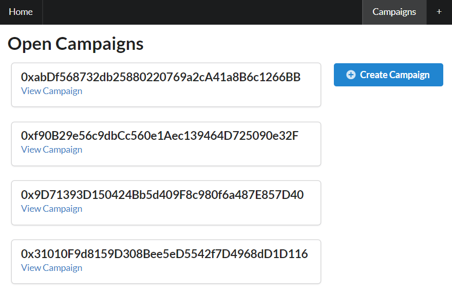
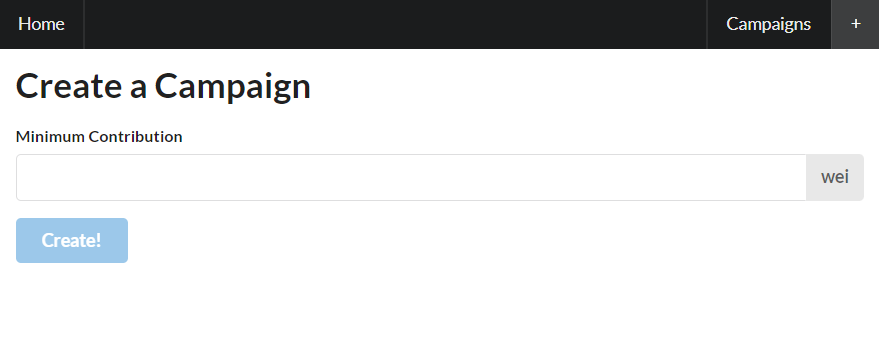
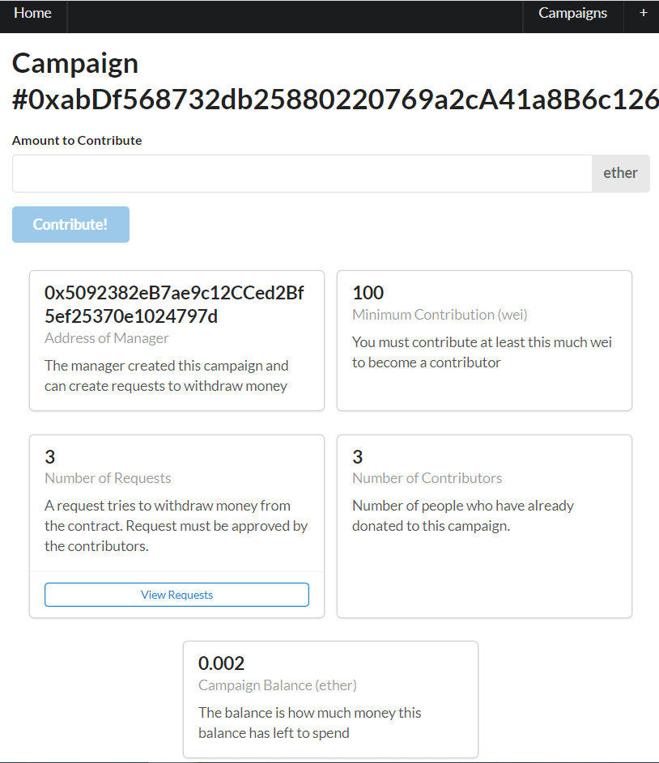
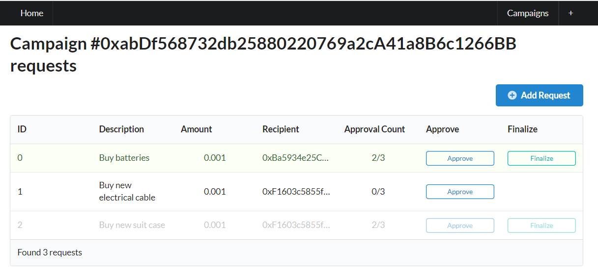
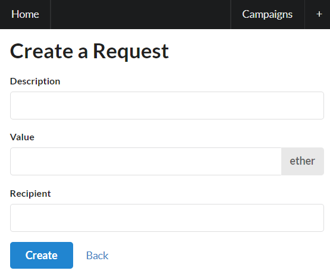

# Crowdfunding Dapp

Ethereum Dapp that allows funding a project or venture by raising money from a large number of people.

The funding process consists of several steps:

1. Manager: Initially, a new campaign must be created and a minimum investment amount must be established. The person who creates the campaign becomes the manager of the campaign.

2. Investors: Individuals who wish to participate in an existing campaign can do so by investing a minimum contribution. All invested funds are collected into a pool, which is held in a smart contract.

3. Voting: To spend money from the pool the manager brings up proposal with detailed information about where the money goes and what the purpose of the expenses. Investors can then vote on whether or not the proposal should be funded.

4. Spend funds: The manager has the authority to approve and spend money from the pool only if a majority of investors have approved the spending proposal.

## Requirements (as client)
To interact with the contract, you need to have Metamask installed in your browser and an active wallet connected to the Sepolia network.

## Requirements (as developer)

To develop this app, you must have access to the Ethereum Sepolia test network. This requires an active Infura account with a valid API key for the Sepolia node, as well as an active Ethereum wallet connected to the Sepolia network.

Then create .env file with INFURA_SEPOLIA and MNEMONIC as shown in .env.example.

## Available Scripts

Run tests:

```
$ npm run test
```

Compile the contract:

```
$ npm run contract:compile
```

You can find the complied version of the contracts in ethereum/build folder

Deploy the contract:

```
$ npm run contract:deploy
```

After the deployment is finished you should see the address of deployed contract in the console:

```
 $ Instance of the contract(address): 0x0824e4...
```

copy it and paste in ethereum/campaignFactory.ts as ADDRESS variable so you can work with deployed instance of the contract.

Run dev environment:

```
$ npm run dev
```

# Features

### Home Page

On the home page you can see the list of active Campaigns also you can create your own Campaign by clicking "Create Campaign" button.


### New Campaign

Here you can create new Campaign and set the minimum amount of contribution to participate in the campaign. User who created the campaign becomes the manager of the campaign.


### Campaign Details

Detailed information about particular Campaign. Here you can contribute to the campaign and become the investor.

By clicking on the "View Requests" you get information about all the spend requests.

### Spend Requests

On this page, all spending requests can be viewed. The manager has the ability to approve requests, while investors can vote on them.


### New Spend Requests

On this page, the manager can create new spending request.


## Tech Stack & Technologies

- React
- Next.js
- TS
- Truffle
- Web3
- Solidity
- Node.js
